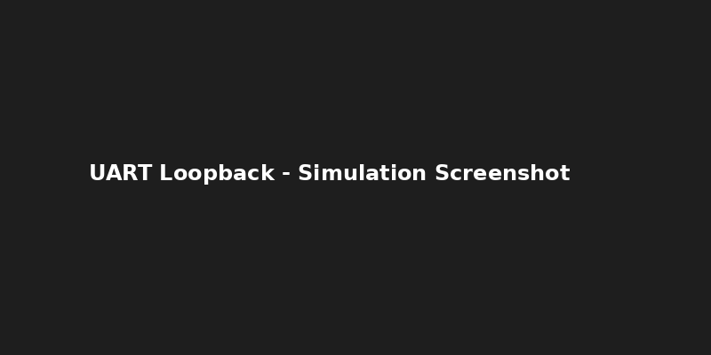

# 🔄 UART Communication Module (Verilog)

## 📝 Description
This project includes a UART Transmitter and Receiver implemented in Verilog with loopback testing functionality.

## 📁 Files
- `UART_TX.v`: Transmitter module
- `UART_RX.v`: Receiver module
- `Top.v`: Combined test for loopback
- `tb_UART_Loopback.v`: Simulation testbench

## 🛠 Tools Used
- **ModelSim**: For simulation
- **Vivado**: For synthesis

## 📷 Screenshot

## ▶️ Simulation Instructions
1. Open ModelSim.
2. Compile and simulate the loopback test.
3. Observe correct transmission and reception.

---

